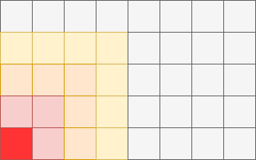

# Why using classes and objects?

A classical problem to illustrate the concept of object and classes is to write a program that 
must calculate the properties of a product surface. The surface will be divided in small 2D 
elements. Each element will have some basic materials properties.

Using these material properties we can calculate the current state of the element. In the context
of OOP these elements represent objects. The description of the required properties for each 
elements is called a class.

With this definition we can now simulate complex physical phenomenons, such as heating the 
surface at a given element. This would be just a change in the temperature property of the 
corresponding element.

Each update cycle will re-calculate the new object state based on its current state and the 
external conditions affection the object. This way we can easily simulate a heat wave 
propagation accross the surface.

So what is an object? Simplified it can be described as an entity which has a state and the 
state can calculated for each moment of time and then memorized.

Now the same example may be applied for many simular problems: 

- Menu in a desktop application
- Maze problems
- Game level design
- etc...