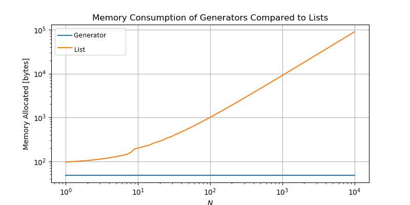

# GENERATOR TUTORIAL

## Table of contents

* [Overview](#overview)
  * [Generator Syntax](#generator-syntax)
  * [Generator Comprehension](#generator-comprehension)
  * [Generator Performance](#generator-performance)
* [Usecases](#usecases)
* [Resources](#resources)
   

## Overview
___________________________________________________________________________________________________

### Generator Syntax

The **yield** statement suspends the function’s execution and sends a value back to the caller, but retains its 
state so that it can be resumed. When resumed, the function continues execution immediately after the last yield run.
This allows its code to produce a series of values over time, rather than computing them at once and sending them 
back like a single list.

    # Subroutine returning a collection object
    def evens(stream):
       them = []
       for n in stream:
          if n % 2 == 0:
             them.append(n)
       return them

    # Generator function which generates a sequence of values
    def evens(stream):
        for n in stream:
            if n % 2 == 0:
                yield n

Generators are a subtype of iterators as they implement the iterator protocol. An iterator object stores its current 
state of iteration and “yields” each of its members in order, on demand via the `__next__()` method until it is 
exhausted. The `__iter()__` method of the iterator protocol can be implemented as a generator. 

The advantages of generators are mainly the reduced memory footprint and the lazy evaluation of of an expression. 
Values in generator expressions are calculated only on-demand.

### Generator Comprehension

The generator comprehension is a short syntax for a simple generator function.
    
    (<expression> for <var> in <iterable> if <condition>

An example illustrating the syntax above is

     num = (x for x in range(100) if x % 2 == 0)
     for x in num:
          print(x)

which is equivalent to

    def num():
        for x in range(100):
            if x % 2 == 0:
                yield x
    
    num_generator = num()
    for x in num_generator:
        print(x)

Another more complex example

     # Yield "apple" if number is even else yield "pie"
     generator = (("apple" if i % 2 == 0 else "pie") for i in range(6))
     for x in generator:
          print(x)

     # Output:
     # -------
     # apple
     # pie
     # apple
     # pie
     # apple
     # pie

In the generic syntax of generator comrehensions `<expression>` is any single line of Python code returning an object.

### Generator Performance

Generators are used mainly for memory efficiency but at the cost of increased complexity and overhead required to 
save the current state of the generator function.

## Usecases
_______________________________________________________________________________________________________________________

1. Increased readability
2. Infinite sequences
3. Reduced memory

See `os.path.walk()` vs `os.walk()`

## Exercises

1. Write an infinite counter generator using the generator API
2. Write a program to compare memory size of list and generator comprehensions
3. Write a generator which calculates fibonacci numbers up to a given limit
4. Write a city ranking generator with delegation (split in city and limit generators)
5. Write a recursive odd number generator

## Resources
_______________________________________________________________________________________________________________________

* <https://www.python-course.eu/python3_generators.php>
* <https://www.youtube.com/watch?v=EnSu9hHGq5o>
* <https://www.python.org/dev/peps/pep-0255>
* <https://www.pythonlikeyoumeanit.com/Module2_EssentialsOfPython/Generators_and_Comprehensions.html>